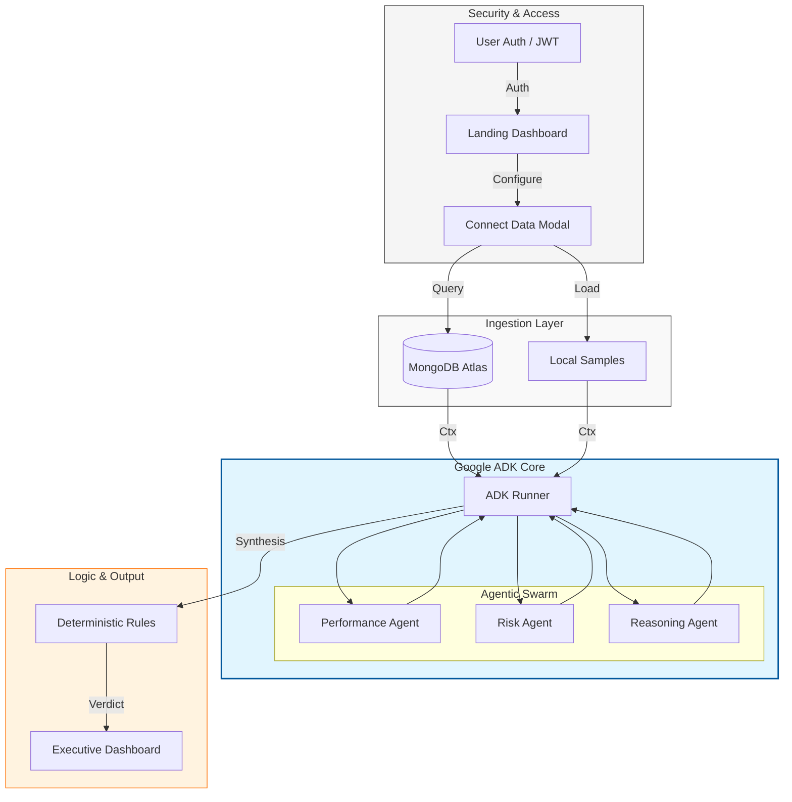

# 🛡️ Contract Intelligence Hub: Enterprise Agentic AI

> **🏢 Strategic Enterprise Context**
> Developed for the **Omani Energy Sector** to transform vendor contract lifecycle management. This platform moves beyond static reporting into **Autonomous Cognitive Auditing**, ensuring peak performance and risk-mitigated decision-making in high-stakes environments.

[]()
[]()
[]()
[]()
[]()
[]()

---

## 🌌 The Vision: Beyond Traditional Audits

In the complex landscape of energy and petrochemicals, manual contract auditing is a trillion-dollar bottleneck. This **Agentic AI Intelligence Hub** solves three critical failures of traditional VCM (Vendor Contract Management):

1.  **Fragmentation**: Unified ingestion from `.csv`, `.json`, `.md`, `.xlsx`, and **Live MongoDB Clusters**.
2.  **Cognitive Load**: Autonomous multi-agent reasoning replaces manual cross-referencing of SLAs and historic incidents.
3.  **Transparency Gap**: Every verdict includes a high-fidelity **Reasoning Chain**, detailing the "Logic Pathway" used by the AI swarm to arrive at a recommendation.

---

## 🏗️ Technical Architecture (Agentic Swarm)

The system utilizes a modular, multi-agent architecture powered by the **Google Agent Development Kit (ADK)** for stateful, secure, and explainable execution.



---

## 🌟 Core Innovations

### 🧠 Federated Multi-Agent Reasoning
Unlike simple chatbots, this system deploys specialized agents:
*   **Performance Analysis Agent**: Calculates KPI trends and historical SLA compliance.
*   **Risk Assessment Agent**: Scrutinizes HSE incidents, financial exposure, and geopolitical factors.
*   **Reasoning Agent**: A "C-Suite" agent that synthesizes reports from the swarm into an audit-ready verdict.

### 🔗 Dynamic "Connect-Your-Source"
The **Data Connectivity Modal** allows executives to plug into any MongoDB cluster in real-time, instantly transforming raw database records into strategic intelligence.

### 🔐 Enterprise Governance & Auth
Integrated **Argon2-hashed authentication** and JWT-based session management ensure that sensitive contract data is only accessible to authorized personnel.

### ⚡ Seamless Key Rotation
Production-hardened failover logic rotates through up to **6 Google API keys** automatically, bypassing the `429 Too Many Requests` quota limits during heavy-load audits.

---

## 🛠️ Unified Tech Stack

| Layer | Technology | Role |
| :--- | :--- | :--- |
| **Orchestration** | **Google ADK** | Core framework for stateful agent sessions. |
| **Intelligence** | **Gemini 2.5 Flash Lite** | High-speed, high-context reasoning engine. |
| **Database** | **MongoDB Atlas** | Primary data source for vendor records. |
| **History** | **SQLite + AioSqlite** | Local session memory for the ADK Runner. |
| **Backend** | **FastAPI** | High-performance asynchronous API layer. |
| **Frontend** | **React 18 + Vite** | Premium, high-contrast dashboard with data-viz. |
| **Auth** | **Argon2 + JWT** | Zero-trust security implementation. |

---

## 🚀 Deployment Guide

### 1. Environment Configuration
Create a `.env` file in the root. The system supports automated key rotation:
```env
# Core API Keys
GOOGLE_API_KEY=primary_key
GOOGLE_API_KEY_2=backup_key_1
GOOGLE_API_KEY_3=backup_key_2

# Database Connectivity
MONGO_URI=mongodb+srv://...
DB_NAME=contract_hub

# Security
JWT_SECRET=your_super_secret_key
```

### 2. Backend Initialization
Requires **Python 3.11+**.
```powershell
# Setup Workspace
python -m venv venv
.\venv\Scripts\Activate.ps1

# Install Dependencies
pip install -r requirements.txt

# Launch API
python src/app.py
```

### 3. Frontend Initialization
```powershell
cd frontend
npm install
npm run dev
```

---

## ⚖️ Compliance & Data Sovereignty
Designed with the **Omani Personal Data Protection Law (PDPL)** in mind.
*   **Regional Deployment**: Optimized for Azure UAE North or local Omani DC.
*   **Audit Trail**: Every decision is stored with a unique `session_id` and the exact `reasoning_chain` used for that specific moment in time.

---

## ⚙️ Governance Logic Framework

The system utilizes a deterministic rule engine to validate agent recommendations:

| Score | Risk | Command | Recommendation |
| :--- | :--- | :--- | :--- |
| ≥ 85 | LOW/MED | **RENEW** | Strategic Vendor - Proceed with renewal. |
| 70 - 84 | MED | **MONITOR** | Decent performance - Bi-weekly audits required. |
| < 70 | HIGH | **RENEGOTIATE** | Term correction or penalty application needed. |
| < 50 | CRITICAL | **TERMINATE** | Systematic failure - Trigger exit strategy. |

---

<p align="center">
  <i>Empowering Energy Leaders with Autonomous Intelligence.</i>
</p>
