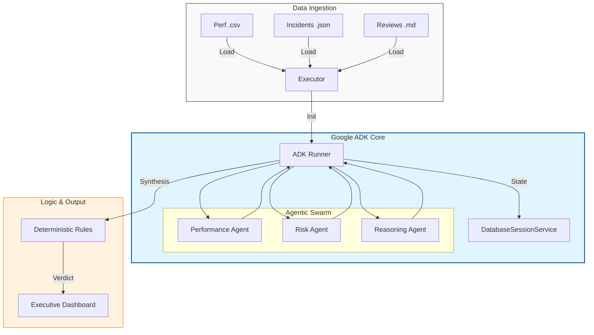

# Agentic AI Contracts Specialist: Intelligence Hub 🚀

[]()
[]()
[]()
[]()
[]()

An advanced **Agentic AI** platform designed using the **Google Agent Development Kit (ADK)** to automate and deepen contract performance evaluation. Moving beyond simple data visualization, this system functions as an **Autonomous Contracts Agent**, utilizing a multi-agent swarm to reason through complex data for executive-level, audit-ready recommendations.

---

## 🏗️ System Architecture (Google ADK Core)

The system leverages the **Google ADK** for sophisticated agent orchestration, stateful session management, and robust multi-agent coordination.



---

## 🌟 Key Features

*   **Google ADK Orchestration**: Uses the `Runner` and `LlmAgent` patterns for enterprise-grade AI execution.
*   **Multi-Agent Swarm**: Specialized agents for Performance Analysis, Risk Assessment, and Final Strategic Reasoning.
*   **Explainable AI (XAI)**: A transparent 5-step **Logic Pathway** revealing the Agent's specific reasoning process and evidence citations.
*   **Deterministic Guardrails**: Guarantees decision consistency through a Python-based rule engine (RENEW, MONITOR, RENEGOTIATE, TERMINATE) that prevents LLM hallucination in final labels.
*   **API Key Rotation**: Automated failover between multiple keys (`GOOGLE_API_KEY_1`, `_2`) to bypass rate-limits.
*   **Data Residency Compliance**: Strategy for **Oman PDPL** alignment using Azure/Google regional datacenters (e.g., UAE North).

---

## 🛠️ Tech Stack

| Component | Technology | Description |
| :--- | :--- | :--- |
| **Orchestration** | **Google ADK** | The core framework for agent management and session persistence. |
| **Intelligence** | **Google Gemini 2.5 Flash** | Primary reasoning engine for high-speed, cost-effective audits. |
| **Backend** | **FastAPI** | High-performance async API Layer. |
| **Frontend** | **React (Vite)** | Modern, high-contrast C-Level dashboard. |
| **Database** | **SQLite + AioSqlite** | ADK-managed session history and conversation state. |

---

## 🏁 Getting Started

### 1. Configuration (.env)
The system supports multiple API keys for high availability. Create a `.env` file in the root:
```env
GOOGLE_API_KEY_1=your_first_key
GOOGLE_API_KEY_2=your_second_key
# The system will automatically rotate if Key 1 hits a 429 Rate Limit.
```

### 2. Backend Setup
```powershell
python -m venv venv
.\venv\Scripts\Activate.ps1
pip install -r requirements.txt
python src/app.py
```

### 3. Frontend Setup
```powershell
cd frontend
npm install
npm run dev
```

---

## ⚙️ Logic Framework (Decision Boundaries)

The system enforces the following mandatory recommendation rules based on synthesized scores and risk levels:

| Condition | Recommendation | Description |
| :--- | :--- | :--- |
| **Score >= 85 & Risk <= MED** | **RENEW** | Strong performer with manageable risk. |
| **Score 70-84 & Risk == MED** | **MONITOR** | Decent performance but requires oversight. |
| **Score < 50 or High Risk/Low Score**| **TERMINATE** | Systematic failure or critical risk exposure. |
| **All Other Cases** | **RENEGOTIATE** | Performance/terms need formal correction. |

---

## ⚖️ Compliance & Governance
Designed for the Omani Energy Sector, the **Intelligence Hub** supports strict data handling protocols. Future implementations are geared toward local hosting or **Azure UAE North** to satisfy Oman's **Personal Data Protection Law (PDPL)** regarding data sovereignty.
